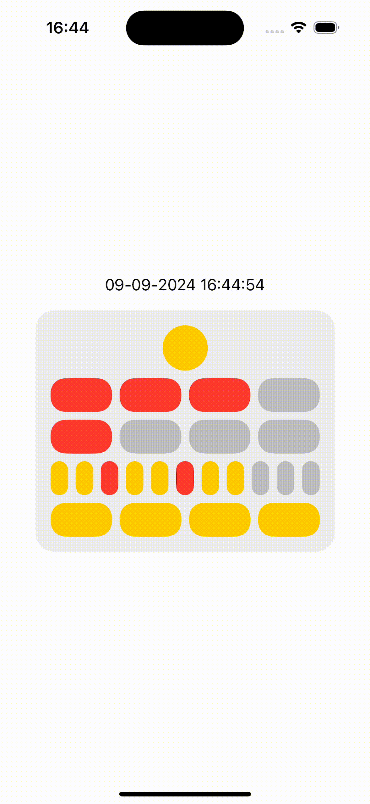

# Berlin Clock Kata

 

## Description
The Berlin Clock (Mengenlehreclock or Berlin Uhr) tells time using illuminated colored blocks. The lights indicate seconds, hours, and minutes in a visually distinct way.

- **Top Lamp**: Blinks to represent seconds (on for even seconds, off for odd).
- **Hour Rows**:
  - Upper row: 5-hour blocks, 4 red lamps.
  - Lower row: 1-hour blocks, 4 red lamps.
- **Minute Rows**:
  - Upper row: 5-minute blocks, 11 lamps (every third is red, others yellow).
  - Lower row: 1-minute blocks, 4 yellow lamps.

You can read more on [Wikipedia](https://en.wikipedia.org/wiki/Mengenlehreuhr).

## Features
- Display the current time using the Berlin Clock pattern.
- Color-coded lamps for seconds, hours, and minutes.

## Requirements
Xcode 15.4
iOS 17.5+

## Getting Started
- Clone the repository
- Open the project
- Select the scheme BNPTest
- Select a simulator iPhone or iPad
- Build and run
